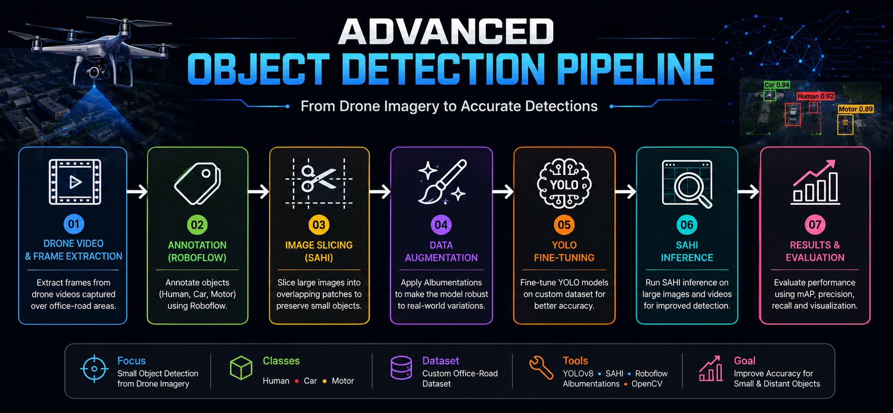

# 🚀 Advanced Object Detection

Advanced object detection workflows developed during my Machine Learning Internship, focusing on **small object detection from drone imagery** using modern Computer Vision and Deep Learning techniques.



---

# 🛰️ Project Overview

This repository documents my complete object detection journey throughout my internship. It captures the entire development pipeline—from preparing datasets and annotating images to training, fine-tuning, SAHI inference, and evaluating real-world performance on drone imagery.

The primary objective is to improve **small object detection** for aerial scenes using both the **VisDrone benchmark dataset** and a **custom office-road dataset** collected during the internship.

---

# 📌 Project Workflow

```text
VisDrone Dataset
        │
        ▼
Dataset Preparation & Cleaning
        │
        ▼
Annotation & Verification
        │
        ▼
Image Slicing (512×512 + Overlap)
        │
        ▼
Data Augmentation
        │
        ▼
YOLO Multi-Class Training
        │
        ▼
Fine-Tuning on Custom Dataset
        │
        ▼
SAHI Inference
        │
        ▼
Performance Evaluation
```

---

# 📂 Repository Structure

```text
Object-Detection-Advanced/

├── docs/
├── src/
├── annotations/
├── augmentation/
├── helper_scripts/
├── office_road_detection/
├── sahi/
├── runs/
├── weights/
│
├── README.md
├── LICENSE
└── banner.png
```

---

# ✨ Project Highlights

- Multi-Class Object Detection
- Custom Office-Road Dataset
- Roboflow Annotation Workflow
- Dataset Cleaning & Label Verification
- Image Slicing & Overlap Processing
- Offline Data Augmentation
- Fine-Tuning Pre-trained YOLO Models
- SAHI-based Small Object Inference
- Performance Benchmarking
- Utility Scripts for Dataset Automation

---

# 🛠️ Technologies Used

- Python
- OpenCV
- Ultralytics YOLO
- SAHI
- Roboflow
- Albumentations
- Streamlit
- NumPy
- Matplotlib

---

# 🎯 Key Learning Outcomes

Throughout this project, I gained practical experience in:

- Small Object Detection
- Drone Vision
- Multi-Class Detection
- Dataset Engineering
- Annotation Pipelines
- Fine-Tuning Strategies
- SAHI Inference
- Data Augmentation
- Performance Evaluation
- End-to-End Computer Vision Pipeline Development

---

# 📈 Current Status

This repository is continuously updated as my internship progresses. New experiments, training pipelines, utility scripts, evaluation results, and documentation are added as each development phase is completed.

---

### 👨‍💻 Author

**M. A. Rehman Naseer**

Machine Learning Intern | Computer Vision | Object Detection | Deep Learning
